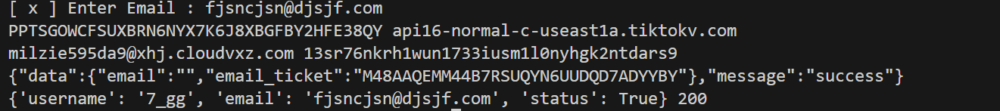

# Email Username Extractor 🚀

## Overview
A lightweight Python script that extracts usernames from structured email content using intelligent text parsing techniques.

## Features
- Fast and lightweight ⚡
- Accurate text parsing 🔍
- Supports HTML email formats 📧
- Easy to integrate into other projects 🔧

## Use Case
Useful for automation, email analysis, and data extraction tasks.

## Tech Stack
- Python 🐍
- Regex & Text Processing
- HTML Parsing

## Contact
Telegram: @h_f_s  
Channel: https://apis_st4
